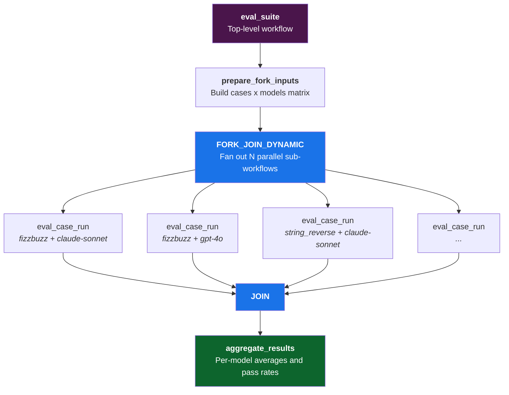
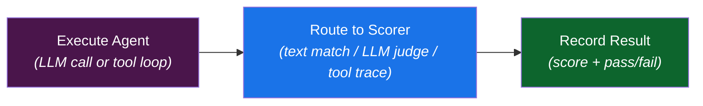

<p align="center">
  <a href="https://github.com/conductor-oss/conductor">
    
  </a>
</p>

<h1 align="center">Conductor Evals</h1>

<p align="center">
  <strong>Run AI evals across multiple models in parallel. One command. Side-by-side results.</strong>
</p>

<p align="center">
  <a href="https://pypi.org/project/conductor-evals"></a>
  <a href="https://pypi.org/project/conductor-evals"></a>
  <a href="https://github.com/conductor-sdk/conductor-evals/blob/main/LICENSE"></a>
  <a href="https://github.com/conductor-sdk/conductor-evals/actions"></a>
  <a href="https://github.com/conductor-oss/conductor/stargazers"></a>
  <a href="https://join.slack.com/t/orkes-conductor/shared_invite/zt-2vdbx239s-Eacdyqya9giNLHfrCavfaA"></a>
</p>

---

### Get running in 60 seconds

```bash
npm install -g @conductor-oss/conductor-cli    # 1. Install the CLI
export ANTHROPIC_API_KEY="sk-ant-..."          # 2. Set at least one provider key
conductor server start                         # 3. Start Conductor (runs on :8080)
pip install conductor-evals                    # 4. Install this package
conductor-eval workers &                         # 5. Start workers (auto-registers workflows)
conductor-eval runmath-basics --models claude-sonnet gpt-4o --wait  # 6. Run!
```

<details>
<summary><strong>See example output</strong></summary>

```
Suite: math-basics | Run: run_a1b2c3d4e5f6 | Status: COMPLETED

Model Summary
Model                       Avg Score  Pass Rate  Passed  Total
claude-sonnet-4-20250514        1.000    100.0%        4      4
gpt-4o                          0.750     75.0%        3      4

Case Results
Case            Model                      Score  Passed
add_simple      claude-sonnet-4-20250514   1.000  PASS
add_simple      gpt-4o                     1.000  PASS
add_decimals    claude-sonnet-4-20250514   1.000  PASS
add_decimals    gpt-4o                     1.000  PASS
...
```

</details>

<!-- TODO: Replace with a terminal recording (asciinema or VHS) of a real eval run.
     Generate with: vhs record demo.tape  or  asciinema rec demo.cast
     Then embed:      -->

### Create your first eval in 60 seconds

```bash
mkdir -p evals/my-eval                        # 1. Create a suite directory

cat > evals/my-eval/capital.json << 'EOF'     # 2. Add a test case
{
  "id": "capital_france",
  "prompt": "What is the capital of France? Reply with just the city name.",
  "agent_type": "direct_llm",
  "scoring_method": "text_match",
  "expected": { "value": "Paris" },
  "match_mode": "contains"
}
EOF

conductor-eval runmy-eval --models claude-sonnet --wait  # 3. Run it!
```

That's one file per test case. No config, no registration, no boilerplate. Add more `.json` files to the suite directory and they're automatically picked up on the next run.

<details>
<summary><strong>Want an LLM-as-judge eval instead?</strong></summary>

For open-ended questions where there's no single right answer, use `llm_judge` scoring:

```bash
cat > evals/my-eval/reasoning.json << 'EOF'
{
  "id": "explain_gravity",
  "prompt": "Explain gravity to a 5-year-old in 2 sentences.",
  "agent_type": "direct_llm",
  "scoring_method": "llm_judge",
  "rubric": "Score 1-5: age-appropriate language, accurate concept, concise (2 sentences)"
}
EOF

conductor-eval runmy-eval --models claude-sonnet gpt-4o --wait
```

</details>

---

## Why Conductor Evals?

| | Conductor Evals | Manual scripts | Other eval frameworks |
|---|---|---|---|
| **Multi-model comparison** | One command, N models in parallel | Write a loop per provider | Varies; often single-model |
| **Execution speed** | Fan-out — 60 evals run concurrently | Sequential by default | Usually sequential |
| **Observability** | Full Conductor UI: timing, retries, logs per task | `print()` and log files | Dashboard if you're lucky |
| **Reproducibility** | JSON cases in git, deterministic mock tool responses | Fragile scripts, no versioning | Config files, but no mock tool layer |
| **Scoring methods** | Text match, regex, LLM-as-judge, tool trace — built in | Roll your own | Typically text match + LLM judge |
| **CI integration** | `--wait -o json` exits with structured results | Custom glue code | Often requires wrapper scripts |
| **Adding a test case** | Drop a `.json` file in a directory | Edit code | Edit code or YAML |

---

## Table of Contents

- [Why Conductor Evals?](#why-conductor-evals)
- [Quick Start](#quick-start)
  - [1. Install the Conductor CLI](#1-install-the-conductor-cli)
  - [2. Set your API keys](#2-set-your-api-keys)
  - [3. Start a Conductor server](#3-start-a-conductor-server)
  - [4. Install Conductor Evals](#4-install-conductor-evals)
  - [5. Configure the Conductor connection (optional)](#5-configure-the-conductor-connection-optional)
  - [6. Start workers](#6-start-workers)
  - [7. Run your first eval](#7-run-your-first-eval)
- [CLI Reference](#cli-reference)
  - [Running evals](#running-evals)
  - [Browsing suites and models](#browsing-suites-and-models)
  - [Managing runs](#managing-runs)
  - [Comparing runs](#comparing-runs)
  - [Output formats](#output-formats)
  - [Model presets](#model-presets)
  - [Custom models](#custom-models)
- [Conductor CLI Reference](#conductor-cli-reference)
- [Web UI](#web-ui)
- [Writing Eval Cases](#writing-eval-cases)
  - [Text match](#text-match)
  - [LLM judge](#llm-judge)
  - [Tool trace](#tool-trace)
  - [Agent types](#agent-types)
  - [Optional fields](#optional-fields)
- [Included Eval Suites](#included-eval-suites)
- [Architecture](#architecture)
- [Extending Conductor Evals](#extending-conductor-evals)
  - [Adding a custom scorer](#adding-a-custom-scorer)
  - [Adding a custom agent type](#adding-a-custom-agent-type)
  - [Adding a custom LLM provider](#adding-a-custom-llm-provider)
  - [Adding a model preset](#adding-a-model-preset)
- [Contributing](#contributing)
- [License](#license)
- [Community](#community)

---

## Quick Start

### 1. Install the Conductor CLI

```bash
npm install -g @conductor-oss/conductor-cli
conductor --version
```

<details>
<summary><strong>Alternative installation methods</strong></summary>

**Quick install (macOS/Linux):**

```bash
curl -fsSL https://raw.githubusercontent.com/conductor-oss/conductor-cli/main/install.sh | sh
```

**Homebrew (macOS/Linux):**

```bash
brew install conductor-oss/conductor/conductor
```

**Quick install (Windows PowerShell):**

```powershell
irm https://raw.githubusercontent.com/conductor-oss/conductor-cli/main/install.ps1 | iex
```

**Manual download:** grab the binary for your platform from the [conductor-cli releases page](https://github.com/conductor-oss/conductor-cli/releases).

See the [conductor-cli repo](https://github.com/conductor-oss/conductor-cli) for full details.

</details>

### 2. Set your API keys

> **Set these before starting the Conductor server.** Workers read API keys from the environment at startup. If the keys aren't set, LLM calls will fail at runtime.

You only need keys for the providers you plan to evaluate:

```bash
# Anthropic (Claude models)
export ANTHROPIC_API_KEY="sk-ant-..."

# OpenAI (GPT models)
export OPENAI_API_KEY="sk-..."
```

<details>
<summary><strong>All supported providers</strong></summary>

```bash
# Google (Gemini models)
export GOOGLE_API_KEY="..."
# or use a service account
export GOOGLE_APPLICATION_CREDENTIALS="/path/to/service-account.json"

# AWS Bedrock
export AWS_ACCESS_KEY_ID="..."
export AWS_SECRET_ACCESS_KEY="..."
export AWS_REGION="us-east-1"

# Azure OpenAI
export AZURE_OPENAI_API_KEY="..."
export AZURE_OPENAI_ENDPOINT="https://your-resource.openai.azure.com"
export AZURE_OPENAI_API_VERSION="2024-12-01-preview"

# Mistral
export MISTRAL_API_KEY="..."

# Cohere
export COHERE_API_KEY="..."

# Together AI
export TOGETHER_API_KEY="..."

# Groq
export GROQ_API_KEY="..."
```

</details>

> **Tip:** Add these to a `.env` file (already in `.gitignore`) and source it: `source .env`

### 3. Start a Conductor server

```bash
conductor server start
```

The server will be available at `http://localhost:8080`.

<details>
<summary><strong>Using Docker instead</strong></summary>

```bash
docker run -d --name conductor -p 8080:8080 orkesio/orkes-conductor-standalone:latest
```

Wait ~30 seconds, then verify it's running:

```bash
curl http://localhost:8080/health
```

See the [Conductor repo](https://github.com/conductor-oss/conductor) for more Docker options.

</details>

### 4. Install Conductor Evals

```bash
pip install conductor-evals
```

<details>
<summary><strong>Install from source</strong></summary>

```bash
git clone https://github.com/conductor-sdk/conductor-evals.git
cd conductor-evals
pip install -e .
```

</details>

### 5. Configure the Conductor connection (optional)

The default config connects to `localhost:8080` — no changes needed for local development.

#### Option A: Environment variables (recommended for remote/CI)

Set these environment variables to connect to any Conductor server:

| Variable | Required | Description |
|----------|----------|-------------|
| `CONDUCTOR_URL` | Yes | Base URL of the Conductor server (e.g., `http://localhost:8080` or `https://my-conductor.example.com`) |
| `CONDUCTOR_AUTH_KEY` | Yes | API key ID for authentication |
| `CONDUCTOR_AUTH_SECRET` | No | API key secret (required for Orkes Conductor; omit for open-source Conductor) |

**Open-source Conductor (no auth or static key):**

```bash
export CONDUCTOR_URL="https://conductor.example.com"
export CONDUCTOR_AUTH_KEY="my-api-key"
```

The key is sent as-is in the `X-Authorization` header.

**Orkes Conductor (JWT auth):**

```bash
export CONDUCTOR_URL="https://play.orkes.io"
export CONDUCTOR_AUTH_KEY="your-key-id"
export CONDUCTOR_AUTH_SECRET="your-key-secret"
```

When `CONDUCTOR_AUTH_SECRET` is set, the system exchanges the key ID and secret for a JWT token via `POST /api/token` and handles automatic token refresh.

> **Tip:** Add these to a `.env` file (already in `.gitignore`) and source it: `source .env`

#### Option B: Config file

If environment variables are not set, the system falls back to `config/orkes-config.json`:

<details>
<summary><strong>Show config format</strong></summary>

```json
{
  "clusters": [
    {
      "name": "local",
      "url": "http://localhost:8080",
      "keyId": "your-key-id",
      "keySecret": "your-key-secret"
    }
  ]
}
```

Copy from the example: `cp config/orkes-config.example.json config/orkes-config.json`

</details>

Environment variables always take precedence over the config file.

### 6. Start workers

```bash
conductor-eval workers    # Auto-registers workflows and starts workers (keep this running)
```

### 7. Run your first eval

```bash
# Quick test with dry-run (no LLM calls, instant results)
conductor-eval runmath-basics --models claude-haiku --dry-run --wait

# Real run against Claude Haiku
conductor-eval runmath-basics --models claude-haiku --wait

# Compare two models
conductor-eval runcoding-basics --models claude-sonnet gpt-4o --wait
```

That's it. You're running evals.

---

## CLI Reference

All commands use a single `conductor-eval` entry point with subcommands.

```
conductor-eval <command> [options]
```

### Running evals

```bash
conductor-eval run <suite> --models <model> [<model> ...] [options]
```

| Flag | Description |
|------|-------------|
| `<suite>` | Name of an eval suite in `evals/`, or path to a directory of JSON cases |
| `--models` | One or more model presets or custom `provider:model_id` specs (see below) |
| `--wait` | Poll until the workflow completes, then print results |
| `--output`, `-o` | Output format: `text` (default), `markdown`, `json`, `csv` |
| `--run-id` | Custom run ID (auto-generated if omitted) |
| `--dry-run` | Skip real LLM calls, use placeholder responses |
| `--tags` | Only run cases matching any of these tags |
| `--exclude-tags` | Exclude cases matching any of these tags |
| `--sample N` | Randomly sample N cases from the suite |
| `--threshold` | Minimum pass rate (0.0-1.0). Exit non-zero if below. Requires `--wait` |

Without `--wait`, the CLI prints the workflow ID and exits — you can check results in the Conductor UI or the Web UI.

### Browsing suites and models

```bash
conductor-eval suites                   # List all eval suites and case counts
conductor-eval cases <suite>            # List cases in a suite (id, agent type, scoring method)
conductor-eval models                   # List available model presets
```

### Managing runs

```bash
conductor-eval runs                     # List all past runs (default: last 20)
conductor-eval runs --suite <suite>     # List runs for a specific suite
conductor-eval runs --limit 50          # Show more results
conductor-eval status <workflow_id>     # Show run status, progress, and results
conductor-eval cancel <workflow_id>     # Cancel a running eval
```

### Comparing runs

Compare two completed runs side-by-side:

```bash
conductor-eval compare <workflow-id-A> <workflow-id-B>
```

```
======================================================================
Run A: run_abc123 (COMPLETED)
Run B: run_def456 (COMPLETED)
======================================================================

Model                            Run A Avg    Run B Avg      Delta
------------------------------ ---------- ---------- ----------
claude-sonnet-4-20250514            0.850      0.900     +0.050
gpt-4o                             0.750      0.800     +0.050
```

Use `--regression-threshold 0.05` to fail if any model's average score drops by more than the threshold (useful in CI).

### Output formats

```bash
# Plain text table (default)
conductor-eval run math-basics --models claude-haiku --wait

# Markdown (good for pasting into PRs/docs)
conductor-eval run math-basics --models claude-haiku --wait -o markdown

# JSON (pipe to jq, save to file, feed into other tools)
conductor-eval run math-basics --models claude-haiku --wait -o json > results.json

# CSV (open in Excel, import into pandas)
conductor-eval run math-basics --models claude-haiku --wait -o csv > results.csv
```

### Model presets

| Preset | Provider | Model ID |
|--------|----------|----------|
| `claude-sonnet` | Anthropic | claude-sonnet-4-20250514 |
| `claude-opus` | Anthropic | claude-opus-4-20250514 |
| `claude-haiku` | Anthropic | claude-haiku-4-5-20251001 |
| `gpt-4o` | OpenAI | gpt-4o |
| `gpt-4o-mini` | OpenAI | gpt-4o-mini |
| `gpt-5` | OpenAI | gpt-5 |
| `gemini-2.5-pro` | Google Gemini | gemini-2.5-pro |
| `gemini-2.5-flash` | Google Gemini | gemini-2.5-flash |
| `gemini-2.5-flash-lite` | Google Gemini | gemini-2.5-flash-lite |

Presets are defined in `config/model-presets.json`. You can add your own there. Run `conductor-eval models` to see all available presets.

### Custom models

You don't need to define a preset to try a new model. Use `provider:model_id` syntax directly:

```bash
# Mix presets and custom models
conductor-eval run math-basics --models claude-sonnet google_gemini:gemini-2.0-flash --wait

# Use any model from any provider
conductor-eval run coding-basics --models openai:o3-mini anthropic:claude-haiku-4-5-20251001 --wait
```

Custom models get default params (`max_tokens: 4096, temperature: 0`). The Web UI also supports this — type `provider:model_id` in the custom model input field.

---

## Conductor CLI Reference

The `conductor` CLI manages your Conductor server and interacts with workflows and tasks.

### Server management

```bash
conductor server start             # Start the Conductor server
conductor server start --port 9090 # Start on a custom port
conductor server stop              # Stop the server
conductor server logs -f           # Tail server logs
```

### Workflow operations

```bash
conductor workflow list                                        # List all workflows
conductor workflow start -w workflow_name -i '{"key":"value"}' # Start a workflow
conductor workflow status <workflow_id>                         # Check workflow status
conductor workflow get-execution <workflow_id>                  # Get full execution details
```

### Task operations

```bash
conductor task list                                            # List all task definitions
conductor task poll <task_type>                                # Poll for a task
conductor task update-execution --workflow-id <id> --task-ref-name <ref>  # Update a task
```

### Global flags

| Flag | Description |
|------|-------------|
| `--server <url>` | Conductor server URL |
| `--auth-token <token>` | Authentication token |
| `--profile <name>` | Configuration profile |
| `--verbose` | Detailed output |
| `--help` | Show help for any command |

For the full CLI documentation, see the [conductor-cli repo](https://github.com/conductor-oss/conductor-cli).

---

## Writing Eval Cases

Eval cases are JSON files in `evals/<suite-name>/`. Each file is one test case. Drop a new `.json` file in a suite directory and it's automatically included in the next run.

### Text match

Check if the model's response contains, matches, or equals expected text.

```json
{
  "id": "add_simple",
  "name": "Add two small numbers",
  "agent_type": "direct_llm",
  "scoring_method": "text_match",
  "prompt": "What is 23 + 47? Reply with just the number.",
  "expected": { "value": "70" },
  "match_mode": "contains"
}
```

**Match modes:** `exact`, `contains`, `regex`, `contains_all`, `contains_any`

For `contains_all` and `contains_any`, use `"expected": { "values": ["foo", "bar"] }`.

### LLM judge

Another LLM scores the response on a 1-5 rubric (normalized to 0.0-1.0, passes at 0.5+).

```json
{
  "id": "ethical_dilemma",
  "agent_type": "direct_llm",
  "scoring_method": "llm_judge",
  "prompt": "Should a hospital deploy an AI system that has 85% accuracy but 15% false positives for critical diagnoses?",
  "rubric": "Score 1-5: identifies tradeoffs, considers patient impact, proposes nuanced approach with human oversight"
}
```

The judge defaults to Claude Sonnet. Override with `"judge_model"` and `"judge_provider"`.

### Tool trace

Verify that a tool-use agent called the right tools with the right arguments.

```json
{
  "id": "file_search",
  "agent_type": "tool_use_agent",
  "scoring_method": "tool_trace",
  "prompt": "Find the definition of 'calculate_tax' in the project.",
  "tools": [
    {
      "name": "grep_search",
      "description": "Search file contents",
      "input_schema": {
        "type": "object",
        "properties": { "pattern": { "type": "string" } },
        "required": ["pattern"]
      }
    }
  ],
  "tool_responses": {
    "grep_search": {
      "default": { "matches": [] },
      "when": [
        {
          "args_contain": { "pattern": "calculate_tax" },
          "response": { "matches": [{ "file": "src/billing.py", "line": 42 }] }
        }
      ]
    }
  },
  "expected_trace": [
    { "tool_name": "grep_search", "args_contain": { "pattern": "calculate_tax" } }
  ],
  "strict_order": false
}
```

`tool_responses` provides mock responses so tests are deterministic. `strict_order` controls whether tool calls must appear in the exact sequence.

### Agent types

| `agent_type` | Description |
|---|---|
| `direct_llm` | Single prompt, single response, no tool use |
| `tool_use_agent` | Multi-turn tool-use loop with mock responses |
| `claude_code_agent` | Shells out to the `claude` CLI |

### Optional fields

| Field | Description |
|---|---|
| `system_prompt` | System prompt passed to the model |
| `tags` | String array for categorization |
| `timeout_seconds` | Per-case timeout hint |
| `max_tool_turns` | Max tool-use iterations (default: 10) |

---

## Included Eval Suites

| Suite | Cases | What it tests |
|-------|-------|---------------|
| `math-basics` | 4 | Simple arithmetic with text matching |
| `coding-basics` | 2 | FizzBuzz, string reversal |
| `tricky-math` | 3 | Order of operations, edge cases |
| `reasoning` | 1 | Ethical reasoning with LLM judge |
| `tool-use` | 1 | Tool call verification |
| `conductor-skill` | 10 | Conductor workflow management with LLM judge |

---

## Web UI

The project includes a web dashboard for managing and monitoring evals.

```bash
conductor-eval server    # Start the web UI server (http://localhost:3939)
```

<details>
<summary><strong>Development mode</strong></summary>

```bash
cd ui
npm install
npm run dev    # Hot reload for frontend development
```

</details>

The UI runs at `http://localhost:3939` and provides:

- **Dashboard** — overview of all eval suites
- **Run management** — start runs with preset or custom models, monitor progress in real-time
- **Results** — sortable results table with expandable details and direct links to Conductor workflow executions
- **Case editor** — view and edit eval cases (form mode or raw JSON)
- **Run comparison** — side-by-side comparison of two runs

Custom models can be added on the fly by typing `provider:model_id` (e.g. `google_gemini:gemini-2.0-flash`) in the model input field.

---

## Architecture



Each `eval_case_run` sub-workflow:



---

## Extending Conductor Evals

The system is built around Conductor workers — stateless Python functions decorated with `@worker_task`. You can add custom scorers, agent types, and LLM providers without modifying the core framework.

### How workers work

Every worker follows the same pattern:

1. **A Python function** in `workers/` decorated with `@worker_task(task_definition_name='your_task')`
2. **An import** in `main.py` so the worker is discovered at startup
3. **Wiring** in the workflow JSON (`workflows/eval_case_run.json`) via a SWITCH task that routes to your worker

Task registration is handled automatically — no need to create separate task definition JSON files.

```
workers/your_worker.py        <-- Python logic
main.py                       <-- Import to register
workflows/eval_case_run.json  <-- Route to it
```

After making changes, restart workers:

```bash
conductor-eval workers    # Restart workers to pick up new code
```

### Adding a custom scorer

Create a new scoring method (e.g., cosine similarity, BLEU score).

**Step 1.** Add a scorer function to `workers/scorers.py`:

```python
@worker_task(task_definition_name='score_cosine_similarity')
def score_cosine_similarity(agent_output: str, expected: dict) -> dict:
    """Score based on cosine similarity between output and expected embeddings."""
    similarity = compute_cosine_similarity(agent_output, expected["value"])
    return {
        "score": similarity,           # float 0.0-1.0
        "passed": similarity >= 0.8,   # bool
        "details": f"Cosine similarity: {similarity:.3f}"
    }
```

All scorers must return `{"score": float, "passed": bool, "details": str}`.

**Step 2.** Add a case to the `route_scorer` SWITCH in `workflows/eval_case_run.json`:

```json
{
  "name": "route_scorer",
  "taskReferenceName": "route_scorer",
  "type": "SWITCH",
  "evaluatorType": "value-param",
  "expression": "scoring_method",
  "decisionCases": {
    "text_match": [ ... ],
    "llm_judge": [ ... ],
    "tool_trace": [ ... ],
    "cosine_similarity": [
      {
        "name": "score_cosine_similarity",
        "taskReferenceName": "score_cosine_similarity",
        "type": "SIMPLE",
        "inputParameters": {
          "agent_output": "${execute_agent.output.response}",
          "expected": "${workflow.input.eval_case.expected}"
        }
      }
    ]
  }
}
```

**Step 3.** Wire the output into `record_result` so it picks up the new scorer's result.

**Step 4.** Use it in an eval case:

```json
{
  "id": "similarity_check",
  "agent_type": "direct_llm",
  "scoring_method": "cosine_similarity",
  "prompt": "Explain photosynthesis in one sentence.",
  "expected": { "value": "Plants convert sunlight into energy using chlorophyll." }
}
```

### Adding a custom agent type

Agent types control how prompts are executed. Built-in types use Conductor's `LLM_CHAT_COMPLETE` system task (`direct_llm`, `tool_use_agent`) or shell out to a CLI (`claude_code_agent`). You can add new ones for custom execution strategies.

**Step 1.** Create a worker function (or add to `workers/agent_executor.py`):

```python
@worker_task(task_definition_name='execute_custom_agent')
def execute_custom_agent(eval_case: dict, model: dict) -> dict:
    """Execute a custom agent loop."""
    prompt = eval_case["prompt"]
    system_prompt = eval_case.get("system_prompt")

    # Your custom logic here
    result = your_custom_execution(prompt, model)

    # Must return this shape
    return {
        "response": result["text"],
        "tool_calls": result.get("tool_calls", []),
        "token_usage": result.get("tokens", {}),
        "latency_ms": result.get("latency_ms", 0)
    }
```

All agent executors must return `{"response", "tool_calls", "token_usage", "latency_ms"}`.

**Step 2.** Add your import to `main.py` if you created a new file.

**Step 3.** Add a case to the `route_agent` SWITCH in `workflows/eval_case_run.json`.

**Step 4.** Use it in eval cases:

```json
{
  "id": "my_test",
  "agent_type": "custom_agent",
  "scoring_method": "text_match",
  "prompt": "What is 2 + 2?",
  "expected": { "value": "4" }
}
```

### Adding a custom LLM provider

For agent types that use Conductor's built-in `LLM_CHAT_COMPLETE` task (`direct_llm`, `tool_use_agent`), providers are configured on the Conductor server via environment variables — no custom code needed.

For agent types that need custom execution (like `claude_code_agent` which shells out to the Claude CLI), you write a provider class:

**Step 1.** Create `providers/your_provider.py`:

```python
class YourProvider:
    def __init__(self, model_id: str, params: dict | None = None):
        self.model_id = model_id
        self.params = params or {}

    def call(self, prompt: str, system_prompt: str | None = None) -> dict:
        """Execute the prompt and return normalized output."""
        start = time.time()

        # Your API call here
        result = call_your_api(prompt, system_prompt, self.model_id)

        return {
            "response": result["text"],
            "tool_calls": result.get("tool_calls", []),
            "token_usage": result.get("usage", {}),
            "latency_ms": int((time.time() - start) * 1000)
        }
```

**Step 2.** Import and use it in your agent executor worker:

```python
if agent_type == "your_custom_type":
    from providers.your_provider import YourProvider
    provider = YourProvider(model_id=model.get("model_id"))
    return provider.call(prompt, system_prompt)
```

### Adding a model preset

Model presets are shortcuts used with `--models` on the CLI and in the Web UI. Add new ones to `config/model-presets.json`:

```json
{
  "llama-70b": {
    "provider": "together",
    "model_id": "meta-llama/Llama-3-70b-chat-hf",
    "params": { "max_tokens": 4096, "temperature": 0.0 }
  }
}
```

No re-registration needed — presets are resolved before the workflow starts. Restart the server to pick up changes.

> **Tip:** You can also use any model on the fly with `provider:model_id` syntax (e.g. `together:meta-llama/Llama-3-70b-chat-hf`) without adding a preset.

### Extension cheat sheet

| What you want to do | Files to change | Restart workers? |
|---|---|---|
| Add an eval case | Drop a `.json` in `evals/<suite>/` | No |
| Add a model preset | Edit `config/model-presets.json` | No (restart server) |
| Use a custom model | Use `provider:model_id` on CLI or Web UI | No |
| Add a scorer | `workers/scorers.py` + `workflows/eval_case_run.json` | Yes |
| Add an agent type | `workers/agent_executor.py` + `workflows/eval_case_run.json` | Yes |
| Add an LLM provider | `providers/*.py` + wire into agent executor | Yes |

---

## Contributing

Contributions are welcome! Here's how to get started:

1. **Fork** the repo and create a feature branch (`git checkout -b my-feature`)
2. **Install** in development mode: `pip install -e ".[dev]"`
3. **Make your changes** — add tests for new functionality
4. **Run the test suite**: `pytest`
5. **Open a pull request** against `main`

### Ideas for contributions

- New scoring methods (e.g., cosine similarity, BLEU score)
- Additional provider adapters
- New eval suites — drop JSON files into `evals/<your-suite>/`
- Improvements to output formatting or CI integrations

<!-- Please see [CONTRIBUTING.md](CONTRIBUTING.md) for detailed guidelines. -->

---

## License

This project is licensed under the Apache License 2.0. See [LICENSE](LICENSE) for details.

---

## Community

<p align="center">
  <a href="https://github.com/conductor-oss/conductor">
    
  </a>
</p>

- **[Slack Community](https://join.slack.com/t/orkes-conductor/shared_invite/zt-2vdbx239s-Eacdyqya9giNLHfrCavfaA)** — Ask questions, share feedback, get help
- **[Conductor GitHub](https://github.com/conductor-oss/conductor)** — The orchestration engine powering this project
- **[Conductor CLI](https://github.com/conductor-oss/conductor-cli)** — The CLI for managing Conductor servers
- **[Conductor Documentation](https://conductor.io/content)** — Official docs and guides
